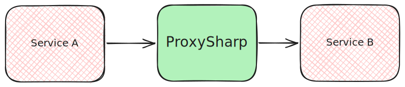

# ProxySharp

## Overview

- Acts as a proxy or a facade to the consumer services.
- Abstracts away internal working of the dependent service.
- Handle cross-cutting concerns (e.g. logging, authentication, caching, etc.)

## To Do

- [x] Authorization and Authentication
- [x] Implement Serilog structured logging
- [x] Implement rate limiting
- [x] Implement tracing
- [ ] Implement testing