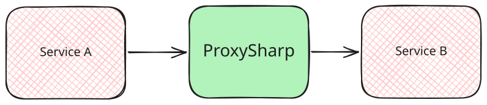

# ProxySharp

(Consumers ←→ ProxySharp ←→ Vendor)

## Overview

- API Gateway for consumer services: Your internal services (consumers) hit the gateway which will forward the request and transform the response from the external service (vendor).
- It provides a "facade" and hides the internal mechanism for the external service, as well as provide other cross-cutting concerns, such as Authentication, Logging, Caching amongst others.

## Background

This was developed out of need at my day job, we have multiple backend services that needed to speak to an external service, for which we had only one user account for governance reason.

What that means is when Consumer N is authenticating and receiving a token would blacklist any previously acquired tokens by other Consumers, as well as lead to other race condition failures, which would be harder to debug in production, as well as shielding the vendor-specific behaviour from the Consumers, and the responsibility (and bugs) lies at one spot rather than being spread out.

This project exposed me to caching and semaphores at scale, which provided an opportunity to further deepen my knowledge around caching issues and different types of locks.

## How it Works

1. Consumer sends a request.
2. ProxySharp validates/authenticates the request.
3. Performs token retreival/refresh.
4. Forwards the request to the vendor/external service.
5. Response is normalised/transformed.
6. Logs the entire journey.

Whenever a service hits this gateway (ProxySharp), it will first check whether a valid token is cached in the memory (validity is checked with expiry date and token not being null or empty), and then proceeds to forward the request.

In case of the token not being valid, or the external service response being HTTP 401 - Unauthorised, we'll fetch a token and then proceed to forward the request.

Any requests hit during the token retreival process will wait until the process is completed - either failed or successful, this is achieved with SemaphoreSlim.

## To Do

- [x] Authorization and Authentication
- [x] Implement Serilog structured logging
- [x] Implement rate limiting
- [x] Implement tracing
- [ ] Implement testing
